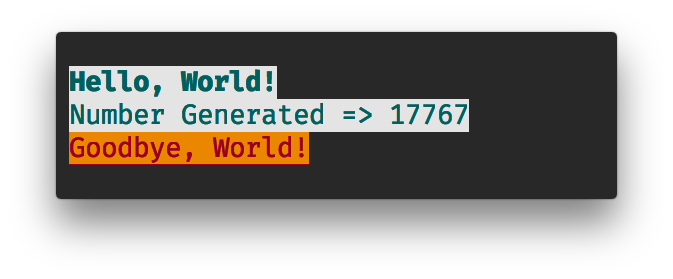

# Ansi Fmt

Formating Text For Terminals.

## About

Ansi Fmt gives bare-bone wrapper around Ansi Terminal Escape Codes.


## Installation

Copy the files from the `include` directory and place them as is.

## Usage

The library provides two Macros
* **z__ansi_fmt()** Formats Text => Sets Color, Bold, Italic etc.
* **z__ansi_scr()** Handles Terminal Screen => Cursor Movement, Clearing Screen etc.

### `z_ansi_fmt(<commands>...)`

Takes a set of comma seperated `Commands` in and Generates that String Literal of required ansi escape codes that formats text.
```c
printf(
    z__ansi_fmt((bold)) //Sets one Bold Text
    "Text Here "
    z__ansi_fmt((clrgb_fg, 254, 134, 0), (underline)) // Sets Foreground Color And Enable Underlines
    "Another Text"
    z__ansi_fmt((reset)) //Resets Changes, back to plain mode
);
```
 The Arguments are expressed similar to Lisp's [S-expression](https://en.wikipedia.org/wiki/S-expression) only difference being we use comma seperation instead of white-space.

#### \<commands\>

These are the viable commands to be used in `z__ansi_fmt`:

#### `(bold)`

Turn On Bold Mode

#### `(underline)`

Turn On Underline Mode

#### `(dim)`

Turn On Dim Mode

#### `(italic)`

Turn On Italic Mode

#### `(reverse)`

Turn On Reverse Mode

#### `(lit)`

Take in Literal Tokens

#### `(no, <option>)`

Disable an `<option>` specified.
    * **<option>**: Can be `bold`
                          |`italic`
                          |`dim`
                          |`reverse`
                          |`underline`


#### `(cl256, <foreground>, <background>)`

Set an Color out of Ansi specified 8bit colors

- **\<foreground\>**: [0-255], Set the foreground color. Has to be literal number or a macro defined number. *Variables* will not work. But `%d` like formats can be used.

- **\<background\>**: [0-255], Set the background color. Has to be literal number or a macro defined number. *Variables* will not work. But `%d` like formats can be used.


#### `(clrgb, <fg-red>, <fg-green>, <fg-blue>, <bg-red>, <bg-green>, <bg-blue>)`

Set True Colors

- **\<fg-red\>**: [0-255], Specify Foreground Red Variant 
- **\<fg-green\>**: [0-255], Specify Foreground Green Variant
- **\<fg-blue\>**: [0-255], Specify Foreground Blue Variant
- **\<bg-red\>**: [0-255], Specify Background Red Variant
- **\<bg-green\>**: [0-255], Specify Background Green Variant
- **\<bg-blue\>**: [0-255], Specify Background Blue  Variant

#### `(clrgb_fg, <red>, <green>, <blue>)`

Only Set the Foreground Color in rgb.

- **\<red\>**: [0-255], Specify Red Variant
- **\<green\>**: [0-255], Specify Green Variant
- **\<blue\>**: [0-255], Specify Blue Variant


#### `(clrgb_bg, <red>, <green>, <blue>)`

Only Set the Background Color in rgb.

- **\<red\>**: [0-255], Specify Red Variant
- **\<green\>**: [0-255], Specify Green Variant
- **\<blue\>**: [0-255], Specify Blue Variant


#### `(plain)`

Set Back To Original/Default Text.


#### `(reset)`

Same as `(plain)`


### `z__ansi_scr(<commands>...)`

Takes a set of comma seperated `Commands` in and Generates that String Literal of required ansi escape codes that formats Screen and Handles Cursor.

```c
printf(
    /* Clears Screen and Set the cursor at the Top-left corner*/
    z__ansi_scr((clear), (jump))
);
```

Notation is similar to that of `z__ansi_fmt`.

#### \<commands\>

#### `(curs)`

Toggle cursor; Show/Hides Cursor.

#### `(clear)`

Clears Screen

#### `(clear_line)`

Clears Line

#### `(high)`

Set High Mode

#### `(low)`

Set Low Mode

#### `(alt_buff)`

Toggle Alternate Buffer

#### `(jump)`

Set Cursor At the Origin

#### `(jumpxy, <row>, <column>)`

Set Cursor to a specified location

- **\<row\>** [number], Specify row
- **\<column\>** [number], Specify column

## Example

```c
#include <stdio.h>
#include <stdlib.h>

#include "include/ansifmt.h"

int main()
{
    fputs(z__ansi_scr(
            (clear), // Clears Screen
            (jump)), // Set Cursor At Top-left corner
        stdout);

    int number = random() &0xFFFF;

    printf(z__ansi_fmt(
            (cl256, 23, 254), // Set 8bit color
            (bold)) // Turn on bold text
                "Hello, World!\n"

        z__ansi_fmt((no, bold))  // Disable Bold Text, color config is still intact.
                "Number Generated => %d\n"

        z__ansi_fmt(
            (clrgb, 156, 0, 33, 234, 134, 0), //Set true color on (rgb)
            (underline))    // Underlines Text
                "Goodbye, World!"

        z__ansi_fmt((reset)) "\n",
            number);

}
```
> Output: <br>



